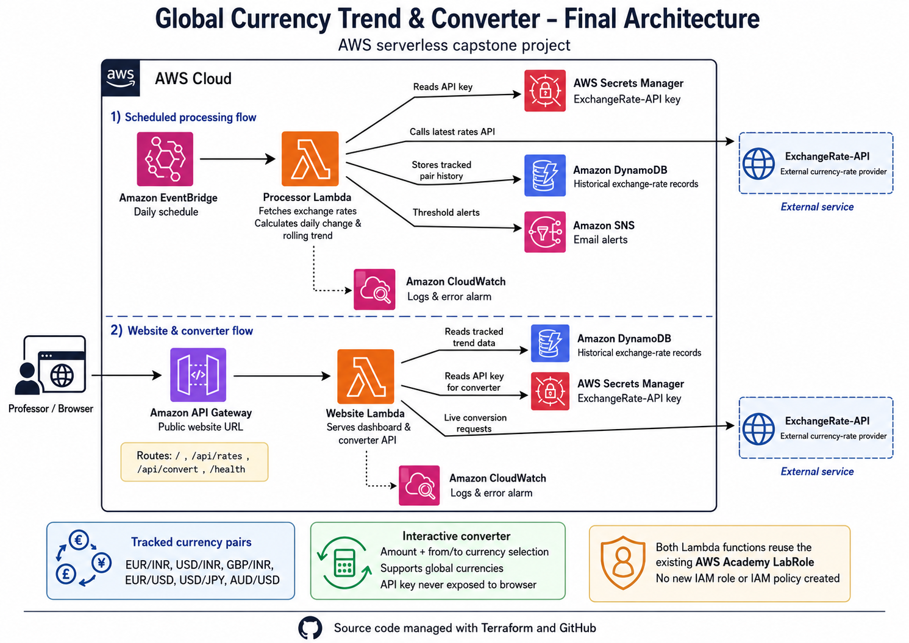

# Global Currency Trend & Converter

A serverless AWS capstone project that collects exchange-rate data, stores historical observations, calculates currency trends, sends threshold alerts, and provides a public interactive currency-conversion website.

## Live Project

- **Live AWS website:** [Global Currency Trend & Converter](https://y0ad11wgrl.execute-api.us-east-1.amazonaws.com/)
- **GitHub repository:** [Yash-1241/currency-rate-capstone](https://github.com/Yash-1241/currency-rate-capstone)
- **AWS region:** `us-east-1`
- **Infrastructure:** Terraform
- **Application language:** Python 3.12

> The live website depends on the AWS Academy Learner Lab resources remaining available.

## Team

**Group 3**

- Yash Gadher — 100007325
- Nishchitha Seega Mallesha — 100007030

## Project Overview

The project contains two connected serverless workflows.

### Scheduled trend-processing workflow

Amazon EventBridge invokes the processor Lambda once per day. The Lambda:

1. Reads the ExchangeRate-API key from AWS Secrets Manager.
2. Requests current exchange rates.
3. Calculates daily percentage movement.
4. Calculates a rolling seven-sample average.
5. Calculates the difference from the rolling average.
6. Stores the results in Amazon DynamoDB.
7. Publishes an Amazon SNS alert when the configured threshold is crossed.
8. Sends logs and errors to Amazon CloudWatch.

### Website and converter workflow

A public Amazon API Gateway HTTP API invokes the website Lambda. The Lambda:

1. Serves the dashboard webpage.
2. Reads tracked historical records from DynamoDB.
3. Provides the `/api/rates` JSON endpoint.
4. Provides the `/api/convert` live conversion endpoint.
5. Reads the API key securely from Secrets Manager.
6. Calls ExchangeRate-API without exposing the secret to the browser.

## Main Features

- Fully serverless AWS architecture
- Infrastructure provisioned with Terraform
- Scheduled exchange-rate collection
- Historical DynamoDB storage
- Daily percentage-change calculation
- Rolling seven-sample average
- Currency trend classification
- Configurable threshold alerts
- SNS email notifications
- Public AWS-hosted dashboard
- Interactive amount-based currency converter
- Five-minute converter-rate caching
- CloudWatch logging and error monitoring
- Unit tests for both Lambda applications

## Tracked Currency Pairs

The scheduled processor stores historical records for:

```text
EUR/INR
USD/INR
GBP/INR
EUR/USD
USD/JPY
AUD/USD
```

These pairs receive:

- scheduled observations,
- historical storage,
- daily-change calculations,
- rolling averages,
- trend information,
- threshold-alert evaluation.

The interactive converter supports 37 commonly used global currencies. Converter selections are not automatically stored as historical trend records.

## Architecture



### Scheduled processing flow

```text
Amazon EventBridge
        ↓
Processor Lambda
        ├── reads API key from Secrets Manager
        ├── calls ExchangeRate-API
        ├── stores history in DynamoDB
        ├── publishes threshold alerts to SNS
        └── writes logs to CloudWatch
```

### Website and converter flow

```text
User browser
        ↓
Amazon API Gateway
        ↓
Website Lambda
        ├── serves the dashboard
        ├── reads trend records from DynamoDB
        ├── reads the API key from Secrets Manager
        ├── calls ExchangeRate-API for live conversions
        └── writes logs to CloudWatch
```

## AWS Services

| AWS service | Purpose |
|---|---|
| Amazon EventBridge | Runs the processor Lambda on a daily schedule |
| AWS Lambda — Processor | Fetches rates, calculates trends, and stores results |
| AWS Lambda — Website | Serves the dashboard and conversion API |
| Amazon API Gateway | Provides the public website and API routes |
| Amazon DynamoDB | Stores exchange-rate history and calculated trend values |
| AWS Secrets Manager | Stores the ExchangeRate-API key securely |
| Amazon SNS | Sends threshold and error-alert emails |
| Amazon CloudWatch | Stores logs and monitors Lambda errors |
| AWS IAM `LabRole` | Existing AWS Academy execution role reused by both Lambdas |

## API Routes

| Route | Purpose |
|---|---|
| `GET /` | Serves the website |
| `GET /index.html` | Serves the website |
| `GET /health` | Returns service-health information |
| `GET /api/rates` | Returns tracked rates and recent history |
| `GET /api/convert` | Performs a live amount-based currency conversion |

Example converter request:

```text
GET /api/convert?from=EUR&to=INR&amount=100
```

Example response structure:

```json
{
  "from": "EUR",
  "to": "INR",
  "amount": 100,
  "conversion_rate": 101.25,
  "converted_amount": 10125,
  "provider": "ExchangeRate-API",
  "generated_at": "UTC timestamp"
}
```

The numeric values depend on the provider's current exchange rate.

## Learner Lab IAM Design

This project does **not** create an IAM role or IAM policy.

Terraform reads the existing AWS Academy role:

```hcl
data "aws_iam_role" "lab_role" {
  name = var.lab_role_name
}
```

Both Lambda functions use the existing role ARN:

```hcl
role = data.aws_iam_role.lab_role.arn
```

This design avoids attempting restricted IAM role creation inside the AWS Academy Learner Lab.

Terraform also creates Lambda resource-based permissions allowing:

- EventBridge to invoke the processor Lambda.
- API Gateway to invoke the website Lambda.

These Lambda permissions are not IAM roles.

## Project Structure

```text
currency-rate-capstone/
├── src/
│   └── lambda_function.py
├── website/
│   ├── handler.py
│   └── index.html
├── tests/
│   ├── test_lambda_function.py
│   └── test_website_handler.py
├── events/
│   └── manual-test.json
├── docs/
│   ├── architecture/
│   │   └── final-architecture.png
│   └── legacy/
├── build/
│   └── .gitkeep
├── cloudwatch.tf
├── data.tf
├── dynamodb.tf
├── eventbridge.tf
├── lambda.tf
├── locals.tf
├── outputs.tf
├── providers.tf
├── secrets.tf
├── sns.tf
├── variables.tf
├── versions.tf
├── website.tf
├── website_outputs.tf
├── terraform.tfvars.example
├── requirements-dev.txt
├── DEPLOYMENT-CHECKLIST.md
├── WEBSITE-SETUP.md
├── UPGRADE-INSTRUCTIONS.md
└── README.md
```

## Prerequisites

- Active AWS Academy Learner Lab
- AWS CLI
- Terraform 1.5 or later
- Python 3.12 or later for local tests
- ExchangeRate-API key
- Git

## Deployment

### 1. Clone the repository

```powershell
git clone https://github.com/Yash-1241/currency-rate-capstone.git
cd currency-rate-capstone
```

### 2. Configure AWS credentials

Start the AWS Academy Learner Lab and copy the current temporary credentials into:

```text
C:\Users\YOUR_USERNAME\.aws\credentials
```

Verify the session:

```powershell
aws sts get-caller-identity
```

### 3. Create local Terraform values

```powershell
Copy-Item terraform.tfvars.example terraform.tfvars
notepad terraform.tfvars
```

Example configuration:

```hcl
aws_region    = "us-east-1"
project_name  = "currency-trend-alert"
environment   = "dev"
lab_role_name = "LabRole"

currency_pairs = [
  "EUR/INR",
  "USD/INR",
  "GBP/INR",
  "EUR/USD",
  "USD/JPY",
  "AUD/USD"
]

alert_threshold_percent = 1.0
schedule_expression     = "cron(0 7 * * ? *)"
enable_schedule         = true
alert_email             = "your.email@example.com"

history_retention_days = 400
log_retention_days     = 14
```

`terraform.tfvars` is ignored by Git and must not be committed.

### 4. Initialize and validate

```powershell
terraform init
terraform fmt -recursive
terraform validate
```

### 5. Run unit tests

```powershell
py -m venv .venv
.\.venv\Scripts\Activate.ps1
python -m pip install -r requirements-dev.txt
pytest -q
```

### 6. Review and apply the Terraform plan

```powershell
terraform plan -out=tfplan
terraform apply tfplan
```

Review the plan before applying. It must not create IAM roles or IAM policies.

### 7. Store the API key securely

Terraform creates the secret resource but does not place the real API key in the Terraform configuration.

```powershell
$secretArn = terraform output -raw exchange_rate_secret_arn

aws secretsmanager put-secret-value `
  --secret-id $secretArn `
  --secret-string '{"api_key":"YOUR_REAL_API_KEY"}' `
  --region us-east-1
```

Do not store the API key in:

- GitHub,
- Terraform source files,
- `terraform.tfvars`,
- screenshots,
- documentation.

### 8. Confirm the SNS subscription

When an alert email is configured, AWS sends a confirmation email.

Open the message and select **Confirm subscription**.

### 9. Run the processor manually

```powershell
$functionName = terraform output -raw lambda_function_name

aws lambda invoke `
  --function-name $functionName `
  --cli-binary-format raw-in-base64-out `
  --payload file://events/manual-test.json `
  response.json

Get-Content response.json
```

### 10. Open the website

```powershell
$websiteUrl = terraform output -raw website_url
Start-Process $websiteUrl
```

## Website Testing

### Health endpoint

```powershell
$websiteUrl = terraform output -raw website_url

Invoke-RestMethod "$websiteUrl/health"
```

### Trend-data endpoint

```powershell
Invoke-RestMethod "$websiteUrl/api/rates?limit=7" |
  ConvertTo-Json -Depth 10
```

### Converter endpoint

```powershell
Invoke-RestMethod `
  "$websiteUrl/api/convert?from=EUR&to=INR&amount=100" |
  ConvertTo-Json -Depth 10
```

## Terraform Outputs

Useful outputs include:

```powershell
terraform output
terraform output -raw lambda_function_name
terraform output -raw dynamodb_table_name
terraform output -raw eventbridge_rule_name
terraform output -raw sns_topic_arn
terraform output -raw website_url
terraform output -raw website_rates_api_url
terraform output -raw website_lambda_function_name
```

## Security Controls

- API key stored in AWS Secrets Manager
- API key never sent to the browser
- No secrets committed to GitHub
- Existing AWS Academy `LabRole` reused
- No IAM role or IAM policy created
- Converter currency codes validated against an allowlist
- Conversion amount must be greater than zero
- Maximum conversion amount enforced
- API Gateway throttling enabled
- DynamoDB data exposed only through the website Lambda
- CloudWatch logging enabled
- Terraform state and local variables ignored by Git
- Lambda packages generated locally and excluded from Git

## What Runs Locally and What Runs in AWS

### Local development tools

- Terraform CLI
- AWS CLI
- Git
- Python unit tests
- Source-code editing
- Local Terraform state

### AWS runtime services

- Processor Lambda
- Website Lambda
- EventBridge schedule
- API Gateway
- DynamoDB
- Secrets Manager
- SNS
- CloudWatch
- Existing AWS Academy `LabRole`

### External services

- ExchangeRate-API
- GitHub

The computer can be switched off after deployment, and the AWS-hosted application can continue running while the Learner Lab resources remain available.

## Monitoring

Processor logs:

```powershell
$logGroup = terraform output -raw cloudwatch_log_group
aws logs tail $logGroup --since 30m --region us-east-1
```

Website logs:

```powershell
$websiteLogGroup = terraform output -raw website_cloudwatch_log_group
aws logs tail $websiteLogGroup --since 30m --region us-east-1
```

## Known Limitations

- The public URL is the automatically generated API Gateway URL.
- Website availability depends on the AWS Academy Learner Lab.
- Trend records exist only for configured currency pairs.
- The converter depends on ExchangeRate-API availability and quota.
- Newly added trend pairs initially have only one historical observation.
- A daily percentage change requires an earlier observation.
- The default schedule uses UTC.
- The public converter is intended for a university demonstration, not production financial use.

## Troubleshooting

### Learner Lab access is denied

Messages containing the following often indicate expired or cancelled temporary credentials:

```text
voc-cancel-cred
ExpiredToken
InvalidClientTokenId
```

Restart the Learner Lab, copy the new credentials, and verify:

```powershell
aws sts get-caller-identity
```

### `LabRole` cannot be found

Confirm that:

```hcl
lab_role_name = "LabRole"
```

Do not create an `aws_iam_role` resource. Confirm the correct existing role name with the instructor when necessary.

### Website data is unavailable

Check:

1. The processor Lambda has run successfully.
2. DynamoDB contains records.
3. The website Lambda environment contains the correct table name.
4. The website Lambda CloudWatch logs contain no access error.

### Live conversion is unavailable

Check:

1. The ExchangeRate-API secret contains a valid key.
2. The API provider account is active.
3. The provider quota is not exhausted.
4. The `/api/convert` API Gateway route exists.
5. The website Lambda CloudWatch logs.

### SNS email does not arrive

Check:

1. The SNS subscription is confirmed.
2. The message is not in the spam folder.
3. A previous historical observation exists.
4. The configured threshold was actually crossed.

### EventBridge runs at an unexpected time

The default schedule is:

```text
cron(0 7 * * ? *)
```

This means 07:00 UTC, not necessarily 07:00 local time.

## Cleanup

After the capstone is complete:

```powershell
terraform destroy
```

Review the destruction plan before confirming.

## Repository Safety

The following files must never be committed:

```text
terraform.tfvars
terraform.tfstate
terraform.tfstate.backup
.terraform/
tfplan
AWS credentials
API keys
generated Lambda ZIP files
.venv/
__pycache__/
```

## Final Deliverables

- Source-code ZIP
- GitHub repository
- README
- Live AWS website
- PowerPoint presentation
- Architecture diagram
